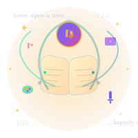

# FableFlow



**AI-powered multimedia story production system**

FableFlow is an open-source platform that converts story manuscripts into multimedia content with narration, illustrations, and video production using AI agents.

[](https://opensource.org/licenses/Apache-2.0)
[](https://www.python.org/downloads/)
[](https://suneeta-mall.github.io/fable-flow)

---

## Overview

FableFlow automates the multimedia book production pipeline using specialized AI agents that handle story refinement, narration, illustration, music, and video assembly.

**Core Components:**
- **Production Pipeline** (`producer/fable_flow/`) - CLI tools for AI-powered content generation
- **FableFlow Studio** (`studio/`) - Web workspace for managing projects and running production workflows
- **Website** (`docs/`) - MkDocs website for FableFlow users with guides and tutorials

## Getting Started

### Installation

```bash
# Clone and install
git clone https://github.com/suneeta-mall/fable-flow.git
cd fable-flow
python3.11 -m venv .venv
source .venv/bin/activate
make install
```

**Requirements:** Python 3.11+, Node.js 18+ (for Studio)

### Usage

**Option 1: Development Environment** (All Services)

```bash
make studio-install  # First time only
make dev-all         # Start Studio + Website
# Studio: http://localhost:3000
# Backend API: http://localhost:8000
# Website: http://localhost:8080

make stop-all        # Stop all services
```

**Option 2: FableFlow Studio** (Web Interface Only)

```bash
make studio-start    # Start Studio only
# Access at http://localhost:3000

make studio-stop     # Stop Studio
```

Features: Project browser, Monaco editor, version comparison, media gallery, real-time production monitoring.

**Option 3: CLI** (Command Line)

```bash
# Run production pipeline
fable-flow publisher process

# Individual steps
fable-flow illustrator draw
fable-flow narration produce
fable-flow music produce
fable-flow story process
```

**Option 4: Website** (Local Development Only)

```bash
make serve  # Serve MkDocs website
# Access at http://localhost:8080
```

## Production Pipeline

FableFlow uses specialized AI agents for each production stage:

1. **Story Processing** - Manuscript refinement and optimization
2. **Narration** - Text-to-speech audio generation
3. **Illustration** - AI-generated contextual images
4. **Music** - Background score composition
5. **Video Assembly** - Combine all elements into final output

See the [complete workflow documentation](docs/fableflow-workflow.md) for more details.

## Configuration

Set environment variables for AI model access:

```bash
export MODEL_SERVER_URL="https://your_api.com/v1"
export MODEL_API_KEY="your_key"
export DEFAULT_MODEL="your_model"
```

See [documentation](https://suneeta-mall.github.io/fable-flow) for custom model configuration.

## Example

The **"Curious Cassie"** children's book series uses FableFlow to produce educational story books that teach scientific concepts to readers aged 5-10.

## Website

FableFlow website at: **https://suneeta-mall.github.io/fable-flow**

Built with MkDocs (`docs/`), includes:
- Getting started guides
- CLI command reference
- Production workflow tutorials
- Configuration examples
- Best practices

### Local Development

```bash
# Serve website locally
make serve
# Access at http://localhost:8080
```

## Contributing

Contributions welcome via:
- Bug reports and feature requests in [Issues](https://github.com/suneeta-mall/fable-flow/issues)
- Pull requests for code improvements
- Documentation enhancements

## License

Apache License 2.0 - see [LICENSE](LICENSE)

## Links

- **Website**: https://suneeta-mall.github.io/fable-flow
- **Repository**: https://github.com/suneeta-mall/fable-flow
- **Issues**: https://github.com/suneeta-mall/fable-flow/issues
- **Contact**: suneetamall@gmail.com

---

Built by [Suneeta Mall](https://github.com/suneeta-mall) and contributors.

