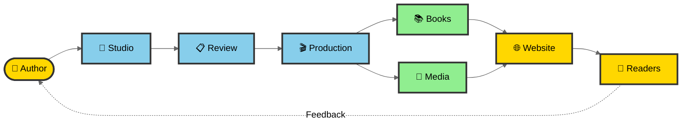

# Welcome to FableFlow 🌟

  

  <h2>Where Stories Come to Life with AI Magic</h2>

  
Discover enchanting stories, create your own adventures, and join a community of curious minds exploring the wonders of AI-powered storytelling

  

    <a href="stories/" class="btn btn-primary">📚 Explore Stories</a>
    <a href="create/" class="btn btn-secondary">✨ Create Your Story</a>
    <a href="curious-cassie/" class="btn btn-cassie">🔍 Meet Curious Cassie</a>
  

---

## Why FableFlow Exists

In our digital age, children are increasingly subjected to passive entertainment that systematically diminishes their innate curiosity and imaginative capabilities. As both a mother and an AI/ML leader, I watched with growing concern as the natural wonder that sparkles in young eyes began to dim under the weight of one-dimensional content consumption.

**Children today are growing up in a world where AI literacy will be as fundamental as reading and writing.** They will need more than facts—they need the curiosity to question, the critical thinking to evaluate AI-generated content, and the creativity to leverage these tools to solve humanity's greatest challenges. Yet traditional children's literature, with its lengthy publishing timelines and gatekeeping structures, wasn't keeping pace with this urgent need.

FableFlow was born from a simple but powerful realization: **what if we could use AI/ML not to replace human creativity, but to enhance it?** What if first-time authors, educators, and parents could transform their educational narratives into complete multimedia experiences without the barriers that have traditionally stood in their way?

This isn't just about making storytelling easier—it's about equipping the next generation with the curiosity-driven mindset they'll need to thrive in an AI-shaped future. Every story created with FableFlow becomes a training ground for wonder, critical thinking, and the joy of discovery.

---

## How FableFlow Works: From Manuscript to Multi-Sensory Magic

Think of FableFlow as your creative co-pilot. You bring the story that matters—the narrative that will spark curiosity, the characters that will inspire wonder, the concepts that will make learning irresistible. FableFlow handles the technical symphony of transforming your manuscript into an immersive multimedia experience.

### Complete FableFlow Journey

**The Complete Journey:**

1. **Author** writes stories in FableFlow Studio
2. **Review** process refines content through AI editorial stages
3. **Production** generates multimedia (narration, illustrations, music, video)
4. **Publishing** creates multiple book formats (PDF, EPUB, HTML)
5. **Community** reads, engages, and provides feedback

[📖 View detailed workflow with all stages, AI agents, and production paths →](fableflow-workflow.md)

### The Four-Stage Creative Pipeline

  

    <h4>📝 Story Enhancement</h4>
    
AI refines your manuscript, optimizes structure, and ensures engaging, age-appropriate content

  

  

    <h4>🎨 Visual Creation</h4>
    
Generate beautiful, consistent illustrations that bring your characters and scenes to life

  

  

    <h4>🎙️ Audio Production</h4>
    
Create natural narration and complementary music that enhance the storytelling experience

  

  

    <h4>🎬 Final Assembly</h4>
    
Combine all elements into professional multimedia presentations ready for sharing

  

### Why This Approach Changes Everything

=== "🧠 Science-Backed Learning"

    **Research shows children exposed to illustrated narratives demonstrate 40% improved comprehension** compared to text-only formats. When visual, auditory, and interactive elements combine, we create neural redundancy—multiple pathways to the same knowledge—making learning both deeper and more durable.

    FableFlow transforms static text into multi-sensory experiences where:

    - **Visual engagement** makes abstract concepts concrete
    - **Auditory narration** brings characters to emotional life
    - **Musical atmosphere** creates emotional resonance
    - **Combined media** invites participation, not passive consumption

=== "🎨 Democratized Creativity"

    Traditional children's book publishing requires:

    - **$5,000-$15,000** for professional illustration
    - **$2,000-$5,000** for narration and audio production
    - **Months of coordination** across multiple vendors
    - **Industry connections** to navigate gatekeepers

    FableFlow eliminates these barriers. What once required a small fortune and insider knowledge now requires only your story and vision. We handle the technical complexity—you focus on crafting narratives that inspire curiosity.

=== "🌟 Future-Ready Mindsets"

    In an era where AI-generated content will be ubiquitous, children need stories that:

    - **Model human-AI collaboration** through their very creation
    - **Celebrate questioning** over rote memorization
    - **Demonstrate scientific thinking** as adventure, not obligation
    - **Show learning happens** through curiosity, not compliance

    Every FableFlow story becomes a living example of how humans and AI can collaborate to create something neither could achieve alone—exactly the mindset this generation will need.

---

## See FableFlow in Action

  

    
    

      <h3>🔍 Curious Cassie Series</h3>
      
Join Cassie's scientific adventures that make STEM learning magical! Each story celebrates brilliant scientists while teaching valuable lessons about curiosity, growth, and discovery.

      

        Ages 5-10
        3 Adventures Available
      

      <a href="curious-cassie/" class="story-link">Explore Cassie's World →</a>
    

  

---

## Choose Your Adventure

  

    <h3>📖 I Want to Read Stories</h3>
    
Dive into our growing collection and experience multi-sensory storytelling that makes learning irresistible

    <a href="stories/" class="btn btn-outline">Browse Story Library</a>
  

  

    <h3>🔍 I Want to Meet Cassie</h3>
    
Start with our flagship series where science becomes adventure and curiosity becomes superpower

    <a href="curious-cassie/" class="btn btn-cassie">Join Cassie's Adventures</a>
  

  

    <h3>✨ I Want to Create Stories</h3>
    
Transform your educational narratives into complete multimedia experiences that inspire the next generation

    <a href="getting-started/installation/" class="btn btn-primary">Start Creating Now</a>
  

  

    <h3>💭 I Want to Understand Why</h3>
    
Explore our Curiosity Chronicles about nurturing wonder in the age of AI

    <a href="blog/" class="btn btn-outline">Read Our Vision</a>
  

---

## Curiosity Chronicles: Our Blog & Knowledge Hub

Explore deeper conversations about curiosity, learning, and AI-powered storytelling:

  

    <h4>🌱 The Curiosity Imperative</h4>
    
Why wonder is the foundation of future-ready learning and how we can nurture it in the age of passive entertainment

    <a href="blog/posts/curiosity_foundation_of_learning/">Read the founding vision →</a>
  

  

    <h4>🤖 AI as Creative Amplifier</h4>
    
How artificial intelligence can democratize storytelling without replacing human creativity and vision

    <a href="blog/">Explore AI insights →</a>
  

  

    <h4>✍️ From Manuscript to Magic</h4>
    
Behind-the-scenes of transforming educational narratives into multi-sensory learning experiences

    <a href="blog/">See creation stories →</a>
  

---

## Honest Transparency: Current Limitations

While FableFlow creates powerful learning experiences, AI-powered content generation is still evolving:

- **🔄 Reproducibility**: Output may vary between runs due to the probabilistic nature of AI models
- **🎨 Visual Generation**: AI art occasionally produces delightfully unexpected results where physics takes creative liberties (we embrace these quirks!)
- **🎬 Video Quality**: Video synthesis technology is emerging; quality and consistency continue improving

We're transparent about these constraints because **honesty matters**. We're continuously refining the platform, and your feedback helps us improve.

---

## Join Our Growing Open Source Community

  

    <h3>📚 Growing Library</h3>
    
Stories that celebrate curiosity and scientific discovery

  

  

    <h3>🌐 Global Collaboration</h3>
    
Storytellers worldwide contributing to the next generation's education

  

  

    <h3>🎓 Educational Impact</h3>
    
Empowering learners and educators with curiosity-driven content

  

### Connect & Contribute

  

    <h4>💬 Join Discussions</h4>
    
Share ideas, get help, and collaborate with fellow storytellers

    <a href="https://github.com/suneeta-mall/fable-flow/discussions" target="_blank">GitHub Discussions →</a>
  

  

    <h4>🔧 Contribute Code</h4>
    
Help shape the future of AI-powered educational storytelling

    <a href="https://github.com/suneeta-mall/fable-flow" target="_blank">GitHub Repository →</a>
  

  

    <h4>📧 Direct Contact</h4>
    
Questions, collaborations, or just want to say hello?

    <a href="mailto:suneetamall@gmail.com">Get in Touch →</a>
  

---

  <blockquote>
    "The best stories don't just entertain—they ignite curiosity. The best tools don't replace creativity—they democratize it. FableFlow is both: a platform for stories that prepare young minds for the extraordinary future they'll create."
  </blockquote>
  
— Suneeta Mall, Creator of FableFlow

  <h3>Ready to Transform Your Story Into Multi-Sensory Magic?</h3>
  <a href="getting-started/installation/" class="btn btn-large btn-primary">🚀 Start Your Journey</a>

