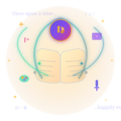
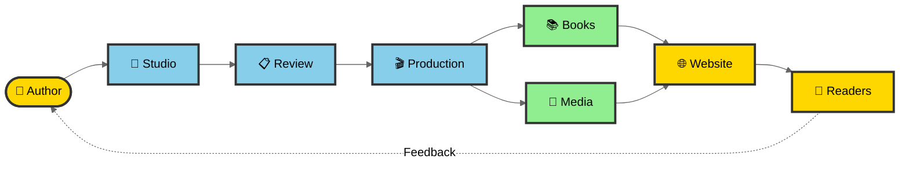

# Welcome to FableFlow 🌟

  

  <h2>Where Stories Come to Life with AI</h2>

  
Read AI-powered stories, create your own, and join a community of educators, parents, and storytellers

  

    <a href="stories/" class="btn btn-primary">📚 Explore Stories</a>
    <a href="create/" class="btn btn-secondary">✨ Create Your Story</a>
    <a href="curious-cassie/" class="btn btn-cassie">🔍 Meet Curious Cassie</a>
  

---

## Why FableFlow Exists

Children are growing up in a world where AI literacy matters as much as reading and writing. They need the curiosity to question, the critical thinking to evaluate AI-generated content, and the creativity to use these tools. Traditional children's publishing, with its long timelines and gatekeeping, doesn't keep pace.

FableFlow uses AI to enhance human creativity, not replace it. First-time authors, educators, and parents can turn an educational manuscript into a complete multimedia book without the usual barriers.

---

## How FableFlow Works: From Manuscript to Multimedia

You bring the story: the narrative, the characters, the concepts. FableFlow turns your manuscript into a multimedia experience.

### Complete FableFlow Journey

```mermaid
%%{init: {'theme':'neutral'}}%%
flowchart LR
    A([👤 Author])
    B[🎨 Studio]
    C[📋 Review]
    D[🎬 Production]
    E[📚 Books]
    F[🎥 Media]
    G[🌐 Website]
    H[👥 Readers]

    A --> B
    B --> C
    C --> D
    D --> E
    D --> F
    E --> G
    F --> G
    G --> H
    H -.->|Feedback| A

    classDef process fill:#87ceeb,stroke:#333,stroke-width:3px
    classDef output fill:#90ee90,stroke:#333,stroke-width:3px
    classDef community fill:#ffd700,stroke:#333,stroke-width:3px

    class B,C,D process
    class E,F output
    class A,G,H community
```

**The Complete Journey:**

1. **Author** writes stories in FableFlow Studio
2. **Review** refines content through AI editorial stages
3. **Production** generates multimedia (narration, illustrations, music, video)
4. **Publishing** creates multiple book formats (PDF, EPUB, HTML)
5. **Community** reads, engages, and provides feedback

[📖 View detailed workflow with all stages, AI agents, and production paths →](fableflow-workflow.md)

### The Four-Stage Creative Pipeline

  

    <h4>📝 Story Enhancement</h4>
    
AI refines your manuscript, optimizes structure, and keeps content age-appropriate

  

  

    <h4>🎨 Visual Creation</h4>
    
Generate consistent illustrations for your characters and scenes

  

  

    <h4>🎙️ Audio Production</h4>
    
Create natural narration and complementary music

  

  

    <h4>🎬 Final Assembly</h4>
    
Combine all elements into multimedia presentations ready to share

  

### Why This Approach Works

=== "🧠 Multi-Sensory Learning"

    Combining visual, auditory, and interactive elements creates multiple pathways to the same knowledge, making it easier to absorb and retain.

    FableFlow turns static text into multi-sensory experiences:

    - **Visual engagement** makes abstract concepts concrete
    - **Auditory narration** gives characters emotional life
    - **Musical atmosphere** adds emotional resonance
    - **Combined media** invites participation, not passive consumption

=== "🎨 Democratized Creativity"

    Traditional children's book publishing requires professional illustration, audio production, vendor coordination over months, and industry connections to reach publishers.

    FableFlow removes these barriers. You bring the story and vision; it handles the technical work.

=== "🌟 Future-Ready Mindsets"

    As AI-generated content becomes common, children need stories that:

    - **Model human-AI collaboration** through how they're made
    - **Celebrate questioning** over rote memorization
    - **Present scientific thinking** as adventure, not obligation

---

## See FableFlow in Action

  

    
    

      <h3>🔍 Curious Cassie Series</h3>
      
Cassie's scientific adventures make STEM learning engaging. Each story celebrates a scientist while teaching curiosity, growth, and discovery.

      

        Ages 5-10
        4 Adventures Available
      

      <a href="curious-cassie/" class="story-link">Explore Cassie's World →</a>
    

  

---

## Choose Your Adventure

  

    <h3>📖 I Want to Read Stories</h3>
    
Browse the collection and experience multi-sensory storytelling

    <a href="stories/" class="btn btn-outline">Browse Story Library</a>
  

  

    <h3>🔍 I Want to Meet Cassie</h3>
    
Start with the flagship series where science becomes adventure

    <a href="curious-cassie/" class="btn btn-cassie">Join Cassie's Adventures</a>
  

  

    <h3>✨ I Want to Create Stories</h3>
    
Turn your educational narratives into complete multimedia books

    <a href="getting-started/installation/" class="btn btn-primary">Start Creating Now</a>
  

  

    <h3>💭 I Want to Understand Why</h3>
    
Read the Curiosity Chronicles on nurturing wonder in the age of AI

    <a href="blog/" class="btn btn-outline">Read Our Vision</a>
  

---

## Curiosity Chronicles: Our Blog & Knowledge Hub

Deeper conversations about curiosity, learning, and AI-powered storytelling:

  

    <h4>🌱 The Curiosity Imperative</h4>
    
Why wonder is the foundation of future-ready learning and how to nurture it

    <a href="blog/posts/curiosity_foundation_of_learning/">Read the founding vision →</a>
  

  

    <h4>🤖 AI as Creative Amplifier</h4>
    
How AI can democratize storytelling without replacing human creativity

    <a href="blog/">Explore AI insights →</a>
  

  

    <h4>✍️ From Manuscript to Multimedia</h4>
    
Behind the scenes of turning educational narratives into multi-sensory learning

    <a href="blog/">See creation stories →</a>
  

---

## Current Limitations

AI-powered content generation is still evolving:

- **🔄 Reproducibility**: Output may vary between runs due to the probabilistic nature of AI models
- **🎨 Visual Generation**: AI art occasionally produces unexpected results where physics takes creative liberties
- **🎬 Video Quality**: Video synthesis is emerging; quality and consistency continue to improve

We're transparent about these constraints and refine the platform with your feedback.

---

## Join Our Open Source Community

  

    <h3>📚 Growing Library</h3>
    
Stories that celebrate curiosity and scientific discovery

  

  

    <h3>🌐 Global Collaboration</h3>
    
Storytellers worldwide contributing content

  

  

    <h3>🎓 Educational Impact</h3>
    
Curiosity-driven content for learners and educators

  

### Connect & Contribute

  

    <h4>💬 Join Discussions</h4>
    
Share ideas, get help, and collaborate with other storytellers

    <a href="https://github.com/suneeta-mall/fable-flow/discussions" target="_blank">GitHub Discussions →</a>
  

  

    <h4>🔧 Contribute Code</h4>
    
Help shape AI-powered educational storytelling

    <a href="https://github.com/suneeta-mall/fable-flow" target="_blank">GitHub Repository →</a>
  

  

    <h4>📧 Direct Contact</h4>
    
Questions or collaborations?

    <a href="mailto:suneetamall@gmail.com">Get in Touch →</a>
  

---

  <h3>Ready to Create Your Story?</h3>
  <a href="getting-started/installation/" class="btn btn-large btn-primary">🚀 Start Your Journey</a>

