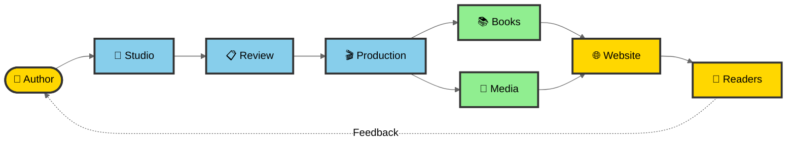
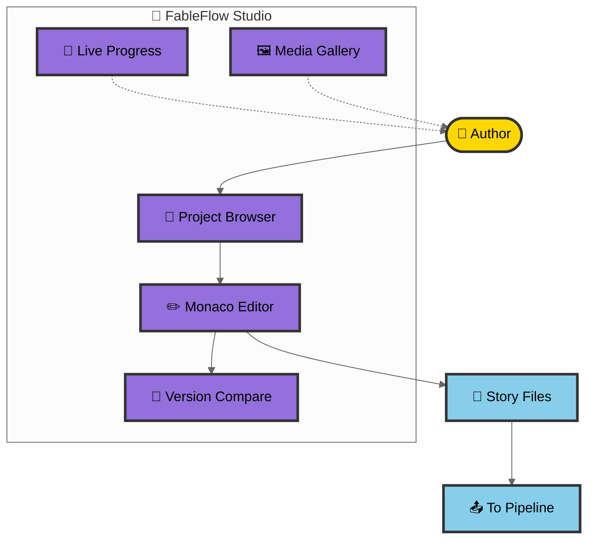
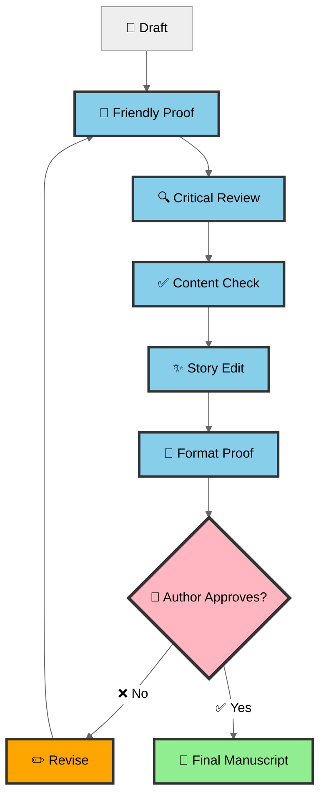
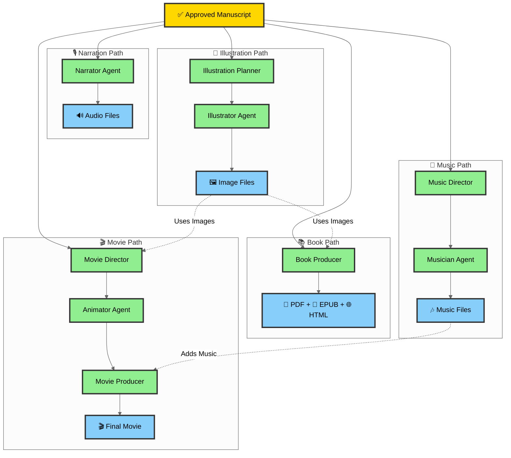
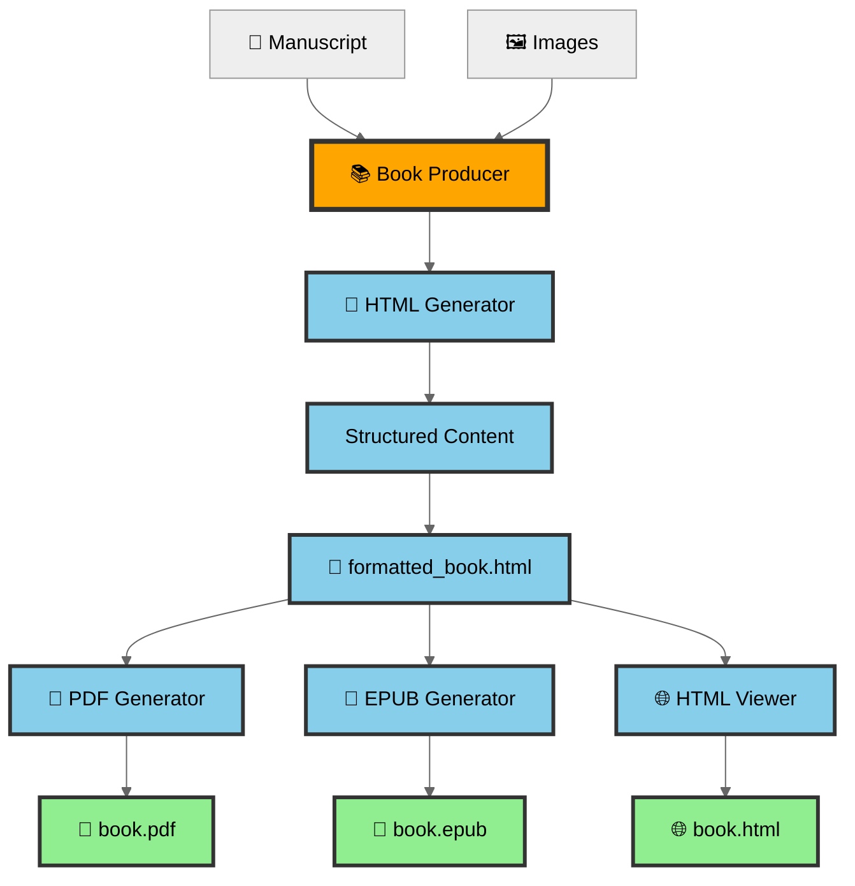
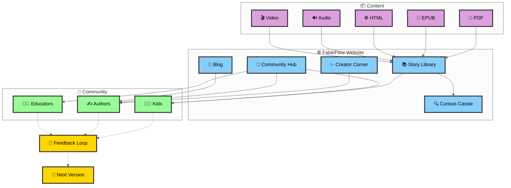

# FableFlow Complete Ecosystem Workflow

## Multi-Step Production & Community Workflow

This document breaks down the FableFlow ecosystem into clear, readable steps showing how stories go from creation to publication.

---

## Step 1: High-Level Overview

The complete FableFlow journey from author to readers:

**Key Stages:**
1. **Author** writes in Studio
2. **Review** process refines content
3. **Production** generates multimedia
4. **Publishing** to multiple formats of books on FableFlow website
5. **Community** reads and provides feedback

---

## Step 2: Author & Studio Interaction

How authors create and manage stories using FableFlow Studio:

**Studio Features:**
- **Project Browser**: Dashboard of all stories
- **Monaco Editor**: Professional code editor
- **Version Compare**: Side-by-side diffs
- **Media Gallery**: Preview outputs
- **Live Progress**: Real-time notifications

**URL:** http://localhost:3000

---

## Step 3: Review & Approval Pipeline

Multi-stage AI editorial process with author control:

**Review Stages:**
1. **Friendly Proof** - Initial feedback
2. **Critical Review** - Professional analysis
3. **Content Check** - Safety validation
4. **Story Edit** - Structure improvements
5. **Format Proof** - Final polish

**Loop:** Reject → Revise → Resubmit until approved

---

## Step 4: Parallel Production Paths

AI agents work simultaneously with dependencies:

### Production Dependencies:

**📚 Book Production** depends on:
- ✅ Manuscript (from Start)
- ✅ Images (from Illustration path)

**🎬 Movie Production** depends on:
- ✅ Manuscript (from Start)
- ✅ Images (from Illustration path)
- ✅ Background music (from Music path)

**🎙️ Narration Path** is independent:
- Creates audio files for standalone listening
- Not used in movie production

**Key Points:**
- All agents start simultaneously when manuscript is approved
- Illustration path completes first → feeds into Book & Movie
- Music path feeds into Movie
- Narration creates separate audio product
- Movie Producer assembles images + music + scenes

**Dashed arrows (-.->)** show dependencies where outputs are used by other agents.

---

## Step 5: Book Production Details

PDF, EPUB, and HTML generation:

### Book Structure Generated:
- Front Cover (with title overlay)
- Title Page
- Publication Information
- Table of Contents
- Preface
- Story Chapters (with images)
- About the Author
- Index
- Back Cover

### Output Formats:

**📕 PDF** (ReportLab):
- Print layout, bookmarks, page numbers, TOC

**📗 EPUB** (EPUB3):
- NCX navigation, OPF manifest, e-reader optimized

**🌐 HTML**:
- Web-friendly, responsive design, browser preview

---

## Step 6: Website & Community

Publishing and feedback ecosystem:

### Website Sections:

**📚 Story Library**
- Browse all published stories
- Read online (HTML/PDF/EPUB)
- Search by genre, age, topic

**🔍 Curious Cassie Series**
- Featured educational children's books
- Ages 5-10, scientific concepts
- Examples: "Magic of YET!", "Beach Quest"

**✨ Creator's Corner**
- Getting started guides
- Tutorials and best practices
- CLI command reference

**🌟 Community Hub**
- Guidelines and forums
- Author collaboration
- Discussion boards

**💭 Curiosity Chronicles**
- Blog with author spotlights
- Behind-the-scenes content
- Tips and platform updates

### Community Benefits:

**👧👦 Kids & Young Readers:**
- Free educational stories
- Interactive multimedia
- Age-appropriate content

**✍️ Authors Community:**
- Learn from tutorials
- Share and get feedback
- Collaborate with others

**👨‍🏫 Educators:**
- Teaching resources
- Curriculum integration
- STEM storytelling

**Website:** https://suneeta-mall.github.io/fable-flow

---

## Complete Workflow Summary

### 📊 Full Journey

1. **✍️ Author Creates** → Writes in FableFlow Studio
2. **📋 Review Process** → 5-stage AI editorial + approval
3. **🎬 AI Production** → Parallel generation (narration, images, music, books, video)
4. **📚 Multi-Format** → PDF, EPUB, HTML, Audio, Video
5. **🌐 Publishing** → Content in Story Library
6. **👥 Community** → Kids, authors, educators read and engage
7. **🔄 Feedback** → Community feedback → Author improves

### 🚀 Key Features

**For Authors:**
- ✅ Professional Studio (Monaco editor, version control)
- ✅ Real-time production monitoring (WebSocket)
- ✅ Multi-format output (5 formats)
- ✅ Community feedback integration

**For Readers:**
- ✅ Free access to quality stories
- ✅ Multiple formats (PDF/EPUB/HTML/Audio/Video)
- ✅ Educational content (STEM)
- ✅ Interactive multimedia

**For Platform:**
- ✅ AI-powered pipeline
- ✅ Open-source community
- ✅ Scalable architecture
- ✅ Professional quality

---

## Technology Stack

### Studio (localhost:3000)
- **Frontend**: React + Vite + Tailwind
- **Editor**: Monaco (VS Code)
- **Backend**: FastAPI + WebSocket

### Production Pipeline
- **Story**: LLM agents (OpenAI/Claude)
- **Narration**: Text-to-Speech APIs
- **Illustration**: DALL-E, Stable Diffusion
- **Music**: AI music generation
- **Video**: FFmpeg assembly

### Book Production
- **HTML**: LLM-generated structure
- **PDF**: ReportLab (Python)
- **EPUB**: Custom EPUB3 generator
- **Images**: PIL/Pillow

### Website (Production)
- **Framework**: MkDocs + Material theme
- **Hosting**: GitHub Pages
- **Features**: Blog, Search, PDF/EPUB readers

---

**FableFlow** - Where imagination meets technology! 🚀📚

*Built with ❤️ by the FableFlow community*
