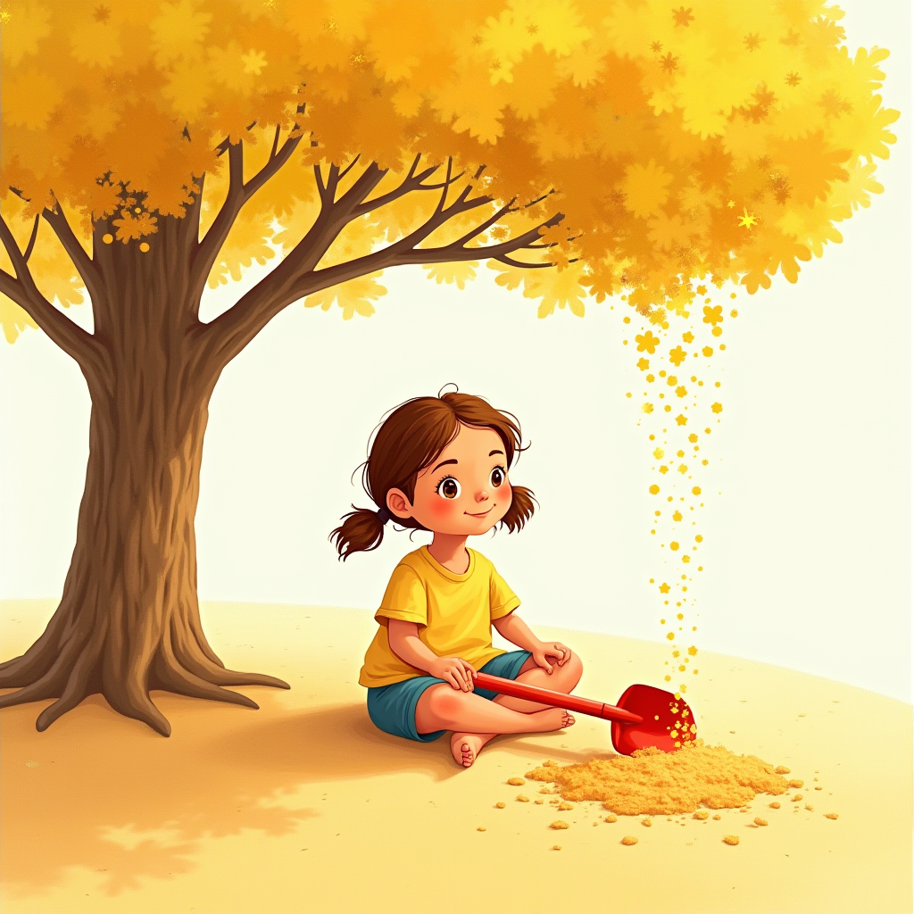
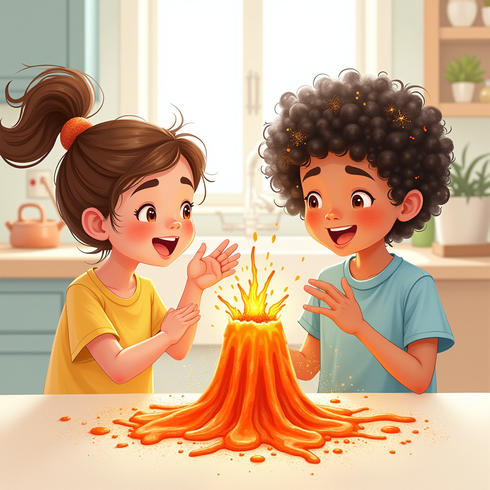

# Story Library

  <h2>Stories That Spark Curiosity and Wonder</h2>
  
Multi-sensory narratives where science becomes adventure, learning becomes irresistible, and every question opens new worlds

---

## The Curious Cassie Series

  

    <h3>Where Science Meets Adventure</h3>
    
Each Curious Cassie story transforms complex scientific concepts into magical adventures that celebrate brilliant discoverers while nurturing the curiosity, critical thinking, and growth mindset children need to thrive in an AI-shaped future.

    

      📚 3 Complete Adventures
      🎯 Ages 5-10
      🔬 STEM + Growth Mindset
    

    <a href="../curious-cassie/" class="btn btn-primary">Explore the Series →</a>
  

  

    
    

      <h4>Cassie, Caleb, and the Magic of YET!</h4>
      
A heartwarming adventure about the power of perseverance, celebrating Dr. Carol Dweck's growth mindset research through Cassie and her little brother's summer journey.

      

        Growth Mindset
        Neuroscience
        Ages 5-10
      

      

        🎙️ Narration
        🎵 Music
        🎨 Illustrations
      

      <a href="../books/curious_cassie/cassie_caleb_n_magic_of_yet/book/" class="story-link">Read Adventure →</a>
    

  

  

    
    

      <h4>Curious Cassie's Beach Ride Quest</h4>
      
Physics becomes play as Cassie discovers Isaac Newton's laws of motion through thrilling beach experiments and hands-on exploration.

      

        Physics
        Newton
        Ages 5-10
      

      

        🧪 Experiments
        🏖️ Beach Adventures
      

      <a href="../books/curious_cassie/curious_cassie_beach_ride_quests/book/" class="story-link">Discover Quest →</a>
    

  

  

    
    

      <h4>Curious Cassie's Harbour Quest</h4>
      
Maritime mysteries and ocean science come alive as Cassie explores the wonders of marine biology and harbor ecosystems.

      

        Marine Biology
        Exploration
        Ages 5-10
      

      

        🌊 Ocean Discovery
        ⚓ Harbor Exploration
      

      <a href="../books/curious_cassie/cassies_harbour_quest/book/" class="story-link">Join Adventure →</a>
    

  

---

## What Makes These Stories Different

  

    <h3>Multi-Sensory Learning</h3>
    
Research shows children exposed to illustrated narratives demonstrate <strong>40% improved comprehension</strong> compared to text-only formats. Every FableFlow story engages visual, auditory, and interactive elements to create neural redundancy—multiple pathways to knowledge that make learning deeper and more durable.

  

  

    

      <h4>🎙️ Professional Narration</h4>
      
AI-generated voices bring characters to life with natural emotion and pacing

    

    

      <h4>🎨 Consistent Illustrations</h4>
      
Beautiful artwork that visualizes concepts and makes abstract ideas concrete

    

    

      <h4>🎵 Atmospheric Music</h4>
      
Background scores that create emotional resonance and enhance engagement

    

    

      <h4>📱 Multi-Format Access</h4>
      
Read online, download PDFs, or access interactive EPUB versions

    

    

      <h4>🧠 Growth Mindset Focus</h4>
      
Stories that teach persistence, curiosity, and the joy of discovery

    

    

      <h4>🔬 Scientific Accuracy</h4>
      
Age-appropriate content that respects both children and science

    

  

---

## For Parents & Educators

  <h3>Supporting Curious Minds</h3>

  

    

      <h4>At Home</h4>
      
Each story includes discussion prompts to spark family conversations about science, growth, and curiosity. Transform screen time into quality learning time that strengthens bonds while building knowledge.

    

    

      <h4>In the Classroom</h4>
      
Stories align with STEM and SEL learning objectives, featuring hands-on extension activities and assessment tools. Perfect for group reading, independent learning, or multimedia presentations.

    

    

      <h4>Learning Outcomes</h4>
      
Beyond subject knowledge, these stories cultivate critical thinking, scientific literacy, and the questioning spirit that drives all genuine learning and innovation.

    

  

---

## Community Contributions

  <h3>Your Story Could Be Here</h3>
  
Stories are currently from the FableFlow author. We're building an open platform where educators, parents, and storytellers worldwide can contribute narratives that inspire the next generation's curiosity.

  

    
<strong>Why contribute?</strong> Share your unique perspective, reach curious minds globally, and join a community dedicated to transforming how children learn through story.

  

  

    <a href="../create/" class="btn btn-primary">Create Your Story →</a>
    <a href="https://github.com/suneeta-mall/fable-flow/discussions" target="_blank" class="btn btn-outline">Join Community →</a>
  

---

  <blockquote>
    "The best stories don't just entertain—they ignite curiosity. The best learning doesn't just inform—it inspires wonder. These stories do both."
  </blockquote>

  

    
Ready to transform your educational narratives into multi-sensory experiences?

    <a href="../create/" class="btn btn-large btn-primary">Start Creating with FableFlow →</a>
  

